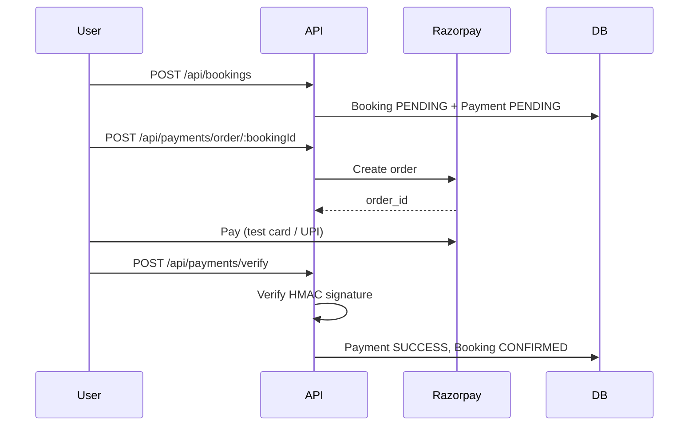

# Razorpay Payment Integration — Stayease

## Payment lifecycle



### Status rules

| Stage | bookingStatus | paymentStatus | Payment.status |
|-------|---------------|---------------|----------------|
| After create | `PENDING` | `PENDING` | `PENDING` |
| After verify/webhook | `CONFIRMED` | `PAID` | `SUCCESS` |
| Payment failed | `PENDING` | `PENDING` | `FAILED` |
| User cancel / hold expired | `CANCELLED` | `PENDING` | `FAILED` |

Pending bookings hold inventory for `PAYMENT_HOLD_MINUTES` (default 15). After expiry they are auto-cancelled on the next booking attempt.

---

## Setup

1. Install dependency:
   ```bash
   cd backend
   npm install
   ```

2. Add Razorpay keys to `.env` (see `.env.example`).

3. Start server:
   ```bash
   npm run dev
   ```

---

## Postman test flow

### 1. Login

```
POST http://localhost:3000/api/auth/login
Content-Type: application/json

{
  "email": "user@example.com",
  "password": "yourpassword"
}
```

Save `token` from response.

---

### 2. Create pending booking

```
POST http://localhost:3000/api/bookings
Authorization: Bearer <token>
Content-Type: application/json

{
  "roomId": "<active_room_id>",
  "checkInDate": "2026-07-01",
  "checkOutDate": "2026-07-05",
  "guests": 2
}
```

Response includes `booking` (`bookingStatus: PENDING`) and `payment` (`status: PENDING`).

Save `booking._id` as `bookingId`.

---

### 3. Create Razorpay order

```
POST http://localhost:3000/api/payments/order/{{bookingId}}
Authorization: Bearer <token>
```

Response:
```json
{
  "success": true,
  "data": {
    "keyId": "rzp_test_...",
    "orderId": "order_...",
    "amount": 4000,
    "currency": "INR",
    "bookingId": "...",
    "paymentId": "..."
  }
}
```

---

### 4. Pay on Razorpay (test mode)

Use Razorpay test checkout or dashboard to complete payment for `orderId`.

Test card: `4111 1111 1111 1111`, any future expiry, any CVV.

After payment you receive:
- `razorpay_payment_id`
- `razorpay_order_id`
- `razorpay_signature`

---

### 5. Verify payment (confirm booking)

```
POST http://localhost:3000/api/payments/verify
Authorization: Bearer <token>
Content-Type: application/json

{
  "razorpay_order_id": "order_...",
  "razorpay_payment_id": "pay_...",
  "razorpay_signature": "..."
}
```

On success: `bookingStatus` → `CONFIRMED`, `paymentStatus` → `PAID`.

---

### 6. Check payment / booking status

```
GET http://localhost:3000/api/payments/status/{{bookingId}}
Authorization: Bearer <token>
```

```
GET http://localhost:3000/api/bookings/{{bookingId}}
Authorization: Bearer <token>
```

---

### 7. Cancel booking (optional)

Only works for owner. Cannot cancel `COMPLETED` bookings.

```
PATCH http://localhost:3000/api/bookings/cancel/{{bookingId}}
Authorization: Bearer <token>
```

---

### 8. Webhook (optional)

Configure in Razorpay Dashboard → Webhooks → `https://your-domain/api/payments/webhook`

Events: `payment.captured`, `payment.failed`, `order.paid`

Header: `X-Razorpay-Signature` (verified with `RAZORPAY_WEBHOOK_SECRET`)

No auth token required. Idempotent via `webhookEventId`.

---

## API summary

| Method | Endpoint | Auth |
|--------|----------|------|
| POST | `/api/bookings` | Yes |
| GET | `/api/bookings/my-bookings` | Yes |
| GET | `/api/bookings/:id` | Yes |
| PATCH | `/api/bookings/cancel/:id` | Yes |
| POST | `/api/payments/order/:bookingId` | Yes |
| POST | `/api/payments/verify` | Yes |
| GET | `/api/payments/status/:bookingId` | Yes |
| POST | `/api/payments/webhook` | No (signature) |

---

## Schema changes

**Booking** — added `paymentExpiresAt` (Date, nullable)

**Payment** — added `userId`, `currency`, `webhookEventId`; unique sparse index on `razorpayOrderId`

---

## Architecture

```
routes → controllers → services → repositories → models
```

- [booking.service.js](src/services/booking.service.js) — booking logic, hold expiry
- [payment.service.js](src/services/payment.service.js) — Razorpay orders, verify, webhook
- [booking.repository.js](src/repositories/booking.repository.js)
- [payment.repository.js](src/repositories/payment.repository.js)
